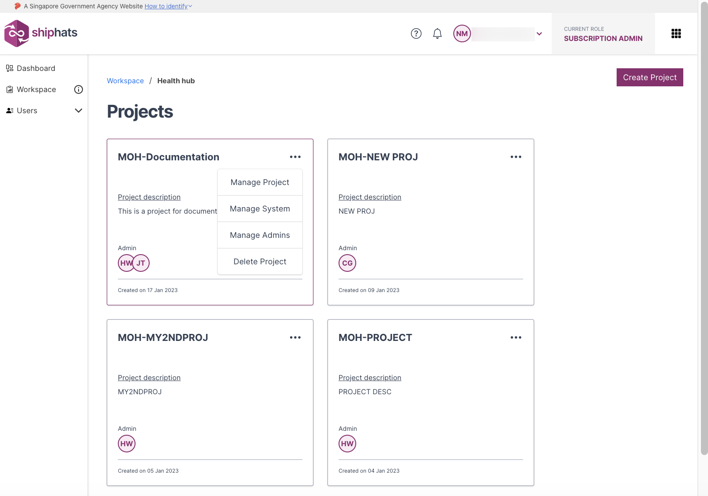
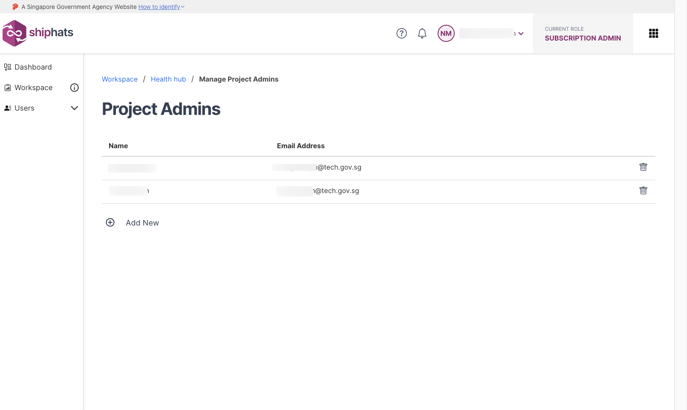
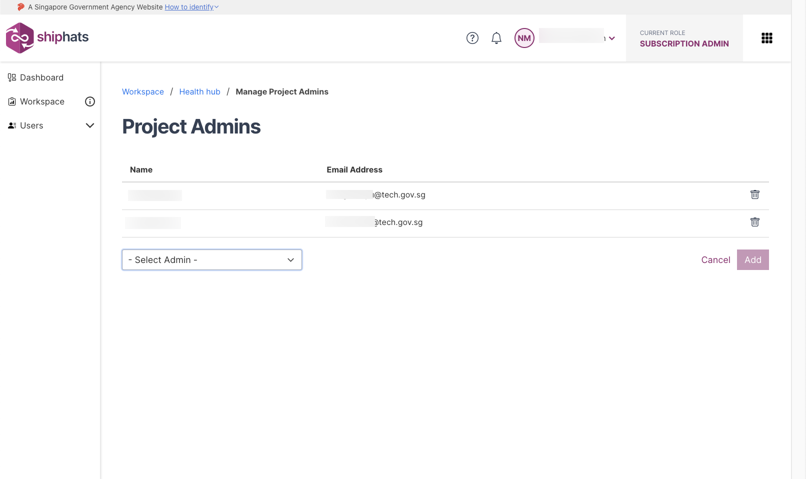
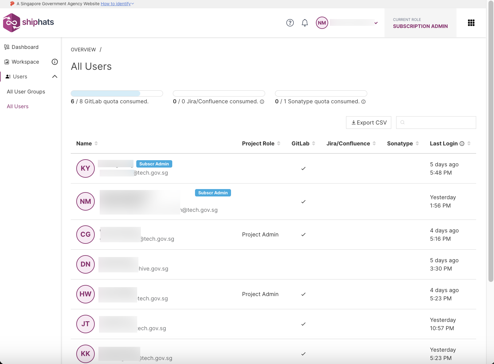
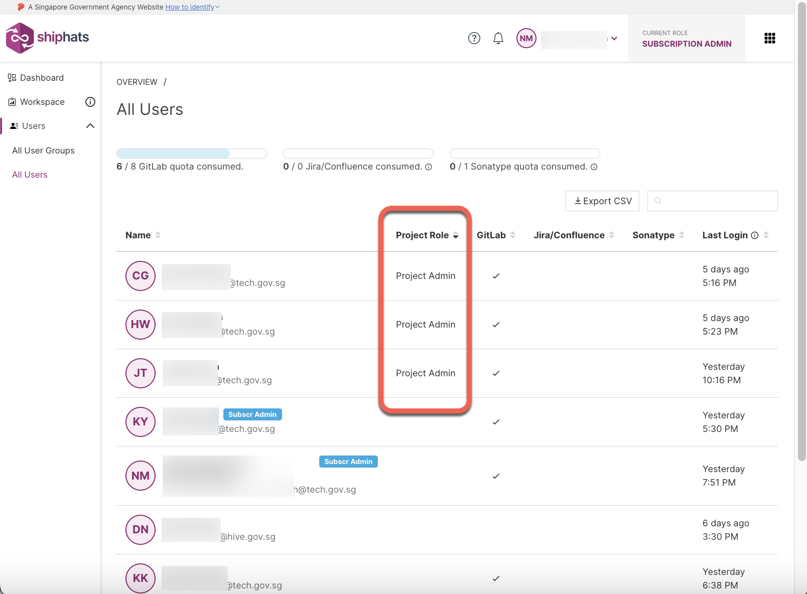

# Manage Admins

**Topics**
- [Add project admins](#add-project-admins)
- [View existing project admins](#view-existing-project-admins)
- [Change subscription admin](#change-subscription-admin)

## Add project admins

Subscription Admins can add Project Admins using the SHIP-HATS portal. When creating a project in an account, it is mandatory to specify at least one Project Admin. SAs can add additional PAs anytime in the future.  

<!--
> **Note:** The number of PAs each project is entitled to is based on the [subscription tier](https://docs.developer.tech.gov.sg/docs/ship-hats-getting-started/#/subscription) quota for which the agency has subscribed.
-->

### To add a project admin

1. From the side menu, click **Workspace**.

    > **Tip:** If needed, [Switch account](manage-account).

    The **Systems** screen appears, displaying all the systems added to your subscription.

    

1. Select the System for which you want to remove a project. 

    The **Projects** screen appears, displaying all the previously added projects. 

    

1. Locate the project for which you want to add a Project Admin, and then click three dots for more options.

    

1. Click **Manage Admins** > **Add New**.  

    

1. In the **Select Admin** drop down list, select the required user.

    >**Note:** Users will appear here only if they were added in the [TechBiz portal](https://portal.techbiz.suite.gov.sg/). <!--If *First Name* and *Last Name* were not provided when creating a new user account, email address will appear in the drop-down list.-->

    

1. Click **Add** to add this user as a project admin.  
   
   After a user is successfully added, an email notification will be sent to the requesting SA with copy sent to other SA and the newly added PA.

## View existing project admins

### To view existing project admins

1. Log in to [SHIP-HATS Portal](http://portal.ship.gov.sg).
1. Click **Users** > **All users**.

    

1. Click **Project Role**.  

   Name of users will appear sorted based on the project role.

    

## Change subscription admin

To change or transfer the existing SA role to another user, the SA can use [the TechBiz portal](http://portal.techbiz.suite.gov.sg/) to [manage the TechBiz account](https://docs.developer.tech.gov.sg/docs/techbiz-documentation/manage-techbiz-account).
