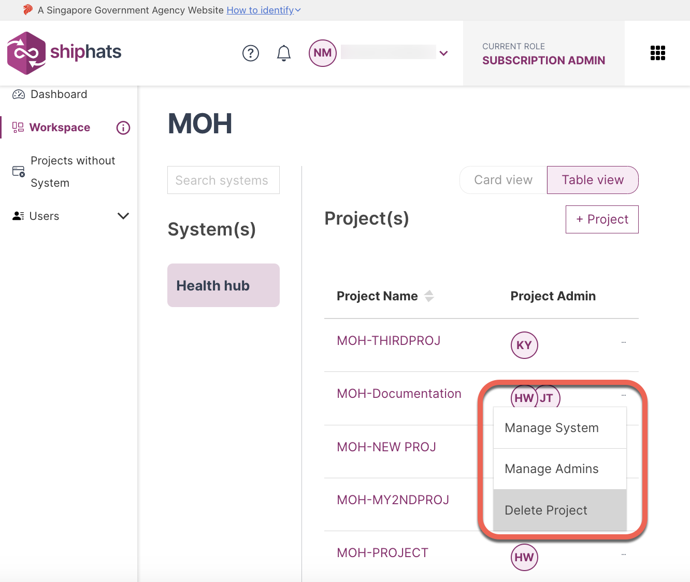

# Manage Projects

**Topics**
- [Create new projects](#create-new-projects)
- [View projects](#view-projects)
- [Remove projects](#remove-projects)

## Create new projects

Subscription Admin (SA) can create new projects in SHIP-HATS and manage them. SAs assign Project Admins (PA). Both SA and PA can manage the projects by adding [project tools](manage-tools), [user groups](manage-user-groups), and [users](manage-users).

### To create a new project

1. From the side menu, click **Workspace**.
    
    The `<Subscription name>` screen appears, displaying all the systems added to your subscription.

    

    > **Tip:** You can also view the 
1. Select the System to which you want to add a project, and then click **+ Project**.  

    

1. Provide information in the following fields:

    |Field|Description|
    |---|---|
    |**Project Name**| Specify name of the project. Your agency name is prefixed to the project name automatically. 
    |**Project Description**| Specify details of the project. 
    |**Project Admin 1**| Select Project Admin from the drop-down list. Users will appear here only if they were added in the [TechBiz portal](https://portal.techbiz.suite.gov.sg/).<!--If you want to invite new users, click **Invite here**. If *First Name* and *Last Name* were not provided when creating a new user account, email address will appear in the drop-down list.-->
    |**Project Admin 2**| This is an optional field. Select a second Project Admin from the drop-down list. Users will appear here only if they were added in the [TechBiz portal](https://portal.techbiz.suite.gov.sg/).<!--If *First Name* and *Last Name* were not provided when creating a new user account, email address will appear in the drop-down list.--> 

1. Click **Create Project**.  
    
    A message appears, indicating **Project Created Successfully**. The created project appears on the **Projects** screen.

    
    
<!--with **Subscribed Tools** and **Not Subscribed Tools** sections based on your subscription.-->

<!--SA or PA can add/create tools and additional PAs.--> 
    
<!--
>> **Note:** The number of PAs each project is entitled to is based on the [subscription tier](https://www.developer.tech.gov.sg/products/categories/devops/ship-hats/subscription) quota for which the agency has subscribed.
-->

<!--
|**System**|Select the system from the drop-down list. This is the same system that you added in [TechBiz](https://docs.developer.tech.gov.sg/docs/techbiz-documentation/). You can view your systems in the **Systems** tab. If you want to manage/add System, you must connect to the [TechBiz portal](https://portal.techbiz.suite.gov.sg/).|

-->

### What's Next 
- [Add a Project Admin](manage-admins)

## View projects

SA and PAs of a subscription account can view all the projects of the subscription account.

### To view a project in a subscription account

1. From the side menu, click **Workspace**.
    
    The `<Subscription name>` screen appears, displaying all the systems added to your subscription.

    

1. Select the System for which you want to view projects. 

    The **Projects** appear in a tabular format. You can choose to view the projects list in **Card view** or **Table view**.

<!--1. Click **Manage** to view tools that are currently added to the project.-->

## Remove projects

Subscription Admin can remove a project if no tool has been added to it. If Tools have been added to a project, you must remove them before the project can be removed.

### To remove a project

1. From the side menu, click **Workspace**.

    > **Tip:** If needed, [Switch account](manage-account).

    The `<Subscription name>` screen appears, displaying all the systems added to your subscription.

    

1. Select the System for which you want to remove a project. 

1. Locate the project that you want to remove, and then click three dots for more options.

    

1. Select **Delete Project**.   

    A **Delete project** pop up appears. 

    

1. If you are sure that you want to delete the project, click **I acknowledge that I have done all the necessary backup for the project**, and then click **Delete**.

    The project is deleted.

### Related Topics
- [Manage Admins](manage-admins)
- [Manage Tools](manage-tools)
- [Manage applications](manage-applications)
- [Manage user groups & users within projects](manage-user-groups-and-users)
- [Manage tokens](manage-tokens) 

<!--The **Projects** screen appears, displaying all the previously added projects. -->
