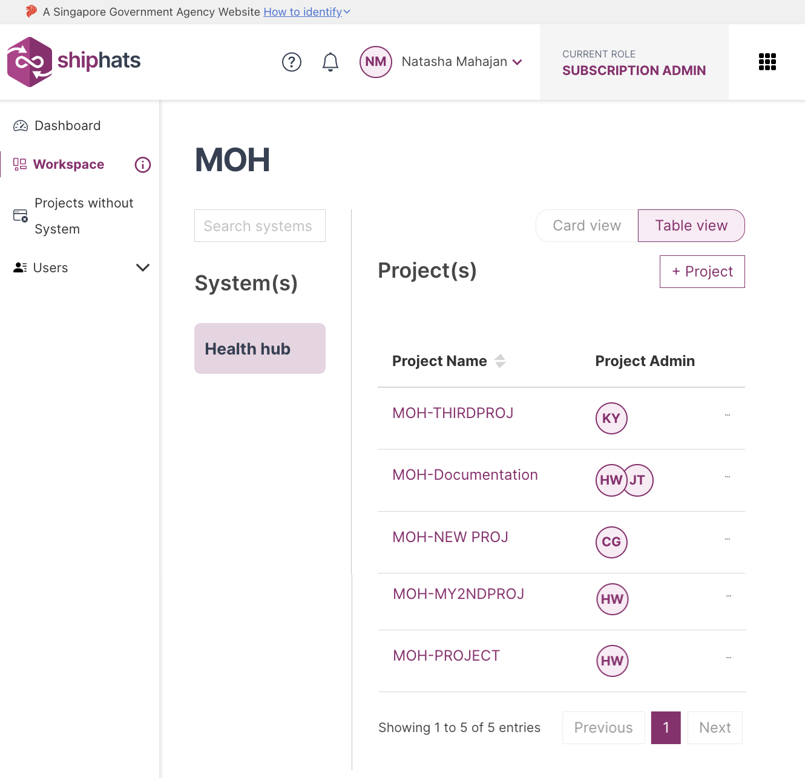
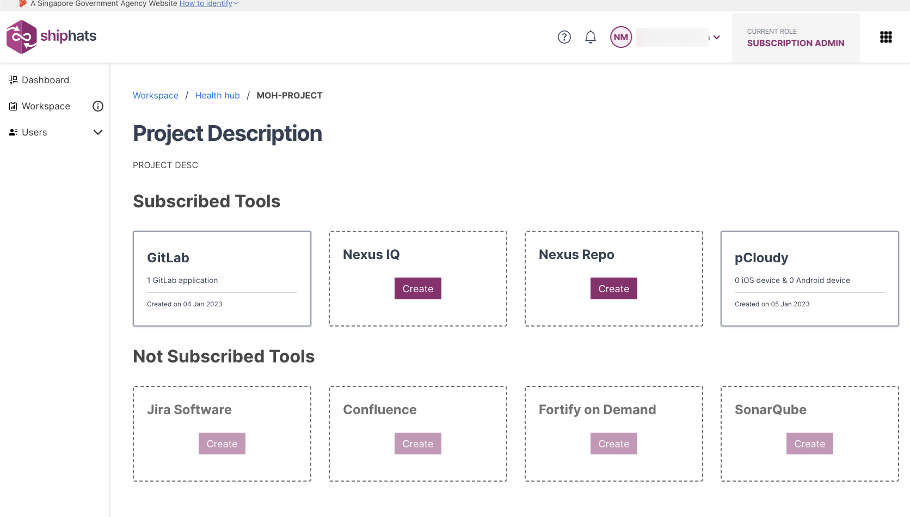
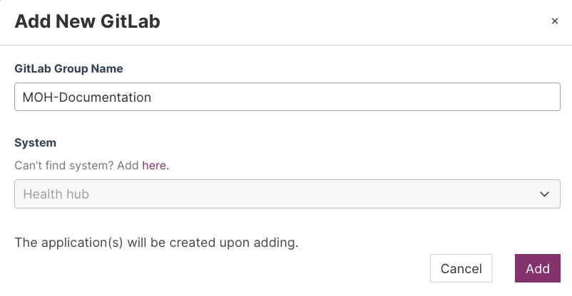
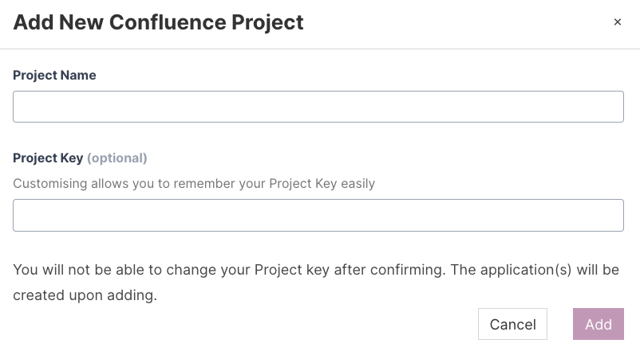
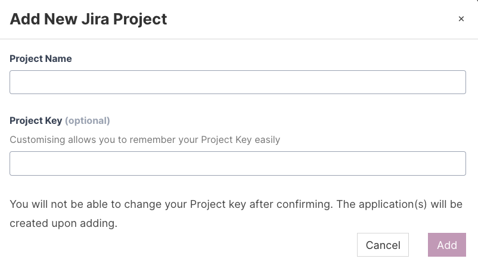
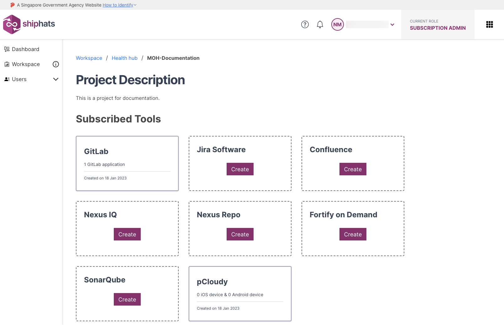

# Manage tools

## Add project tools

[Add project tool](./snippets/provision-tool.md ':include')

## Add project tool with customised project key

[Add project tool with customised project key](./snippets/provision-tool-customized-key.md ':include')

## View project tools

[View Project Tools](./snippets/view-project-tools.md ':include')

## Remove project tools

[Remove project tools](./snippets/remove-project-tools.md ':include')

<!--# Manage tools

**Topics**

- [Add project tools](#add-project-tools)
- [Add project tool with customised project key](#add-project-tool-with-customised-project-key)
- [View project tools](#view-project-tools)
- [Remove project tools](#remove-project-tools)

## Add project tools

SA or PA can add the required project tools as explained below. You can add tools under the **Subscribed Tools** section based on the tools quota allotted for your subscription type. 

### To add project tools

1. From the side menu, click **Workspace**.
    
    The `<Subscription name>` screen appears, displaying all the systems added to your subscription.

    

1. Locate the project to which you want to add a tool, and then click the project.

    **Project Description** screen appears, displaying the **Subscribed Tools** that the SA added in the TechBiz portal. You can also view **Not Subscribed Tools** that SA can subscribe via the TechBiz portal.

    > **Note:** Alternately, click three dots for more options, and then click **Manage Project**.

    

1. Locate the tool that you want to add, click **Create**, and follow the specific steps in table for the tool that you want to add.

    |Available Tools (Base)|Steps|
    |---|---|
    |**GitLab**|Make sure that at least 1 Project Admin has a GitLab account and is added to the TechPass group. Provide value in the **GitLab Group Name** field. <!-- If you cannot find your system in the drop-down list, follow the steps to [Declare a DGP System](declare-dgp-systems).-->
<!--  
    |**Nexus IQ**|Provide values in the **Application Name** and **Application ID** fields.|
    |**Nexus Repo**|Submit a [service request](https://docs.developer.tech.gov.sg/docs/ship-hats-support/raise-service-request/) to add this tool.
    |**pCloudy**|The **Add New pCloudy Application** popup appears, displaying the allowed number of parallel shared mobile device tests.|

    |Available Tools (Add-ons)|Steps|
    |---|---|
    |**Confluence**|Make sure that you have subscribed to this product via the TechBiz portal for it to be listed in **Subscribed Tools**. Provide value in the **Project Name** field.   
    |**Fortify on Demand**| Make sure that you have subscribed to this product via the TechBiz portal for it to be listed in **Subscribed Tools**. Provide value in the **Application Name** and **Release name** fields. **Release name** is an optional field.      
    |**Jira**|Make sure that you have subscribed to this product via the TechBiz portal for it to be listed in **Subscribed Tools**. Provide value in the **Project Name** field.  
    |**Prisma Cloud**|Make sure that you have subscribed to this product via the TechBiz portal for it to be listed in **Subscribed Tools**. Provide value in the **App name** field.|
    |**SonarQube**|Make sure that you have subscribed to this product via the TechBiz portal for it to be listed in **Subscribed Tools**. Make sure that you have logged in to [SonarQube Community Edition](https://sonar.hats.stack.gov.sg/sonar) or [SonarQube Developer Edition](https://sonar1.hats.stack.gov.sg/sonar) at least once. provide values in the **Application Type** and **App Name** fields.  

    >**Note:** After you reach the quota, the respective tool name(s) will be disabled in the **Select Tool** drop-down list. If you still want to add these tools, send an email to [enquiries_ENP@tech.gov.sg](enquiries_ENP@tech.gov.sg).    

1. Click **Add**.   
    
    The selected project tool and application is added.

## Add project tool with customised project key
Subscription Admin (SA) and Project Admin (PA) can customise the project keys when adding app tools on SHIP-HATS. This feature is currently available for following tools:

- Jira 
- Confluence

### To add a project with customised project key 

1. From the side menu, click **Workspace**.
    
    The `<Subscription name>` screen appears, displaying all the systems added to your subscription.

    

1. Locate the project to which you want to add a tool with customised key, and then click the project.

    **Project Description** screen appears, displaying the **Subscribed Tools** that the SA added in the TechBiz portal. You can also view **Not Subscribed Tools** that SA can subscribe via the TechBiz portal. 

    > Make sure that you have subscribed to Jira/Confluence product via the TechBiz portal for it to be listed in **Subscribed Tools**.

    

1. Locate the tool that you want to add with a customized key, click **Create**.

1. In the **Project Name** field, provide a value. 

1. In the **Project Key** field, enter the required project key. A project key can include:
    - 2-10 characters
    - Can contain uppercase letters A-Z 
    - Can contain numbers from 0-9
    - First character must be an alphabet 
1. Click **Add**.  
    
    The project tool with customised project key is added. 

## View project tools

### To view project tools

1. From the side menu, click **Workspace**.
    
    The `<Subscription name>` screen appears, displaying all the systems added to your subscription.

    

1. Locate the project for which you want to view tools, and then click the project.

    **Project Description** screen appears, displaying the **Subscribed Tools** that the SA added in the TechBiz portal. You can also view **Not Subscribed Tools** that SA can subscribe via the TechBiz portal. 

    > Make sure that you have subscribed to the required tool via the TechBiz portal for it to be listed in **Subscribed Tools**.

    

## Remove project tools

As a Subscription Admin or a Project Admin, you can **remove a tool or an app** when it is not required. You **[must take backup](#to-take-backup-of-a-project-tool)** before removing a project tool. 

You can remove the following tools: 

- GitLab
- Confluence
- Fortify on Demand
- Jira
- Nexus IQ
- SonarQube

## To take backup of a project tool

As a Project Admin (PA), you can use the information in the following table based on your requirement:

|Tool|What to do|
|---|---|
**Confluence**|Export space as XML|
**Jira**|Export project with issues as XML|
**GitLab**|Clone Repos and Pipelines|
**Nexus IQ**|Download the required reports
**Nexus Repo**|Download the required artifacts

### To remove a project tool

1. Make sure that you **[take backup or download the required artifacts](#to-take-backup-of-a-project-tool)**.
1. From the side menu, click **Workspace**.
    
    The `<Subscription name>` screen appears, displaying all the systems added to your subscription.

    

1. Locate the project to which you want to remove a tool, and then click the project.

    **Project Description** screen appears, displaying the **Subscribed Tools** that the SA added in the TechBiz portal. You can also view **Not Subscribed Tools** that SA can subscribe via the TechBiz portal. 

    

1. Click the tool that want to remove, and then click **Remove** in the upper right corner.

    The **Remove Application** window appears. 
    
1. Enter the requested information, and then click **Proceed**.  

    The selected app is removed. If this the last or only app for the tool, the project tool is also removed. 

-->