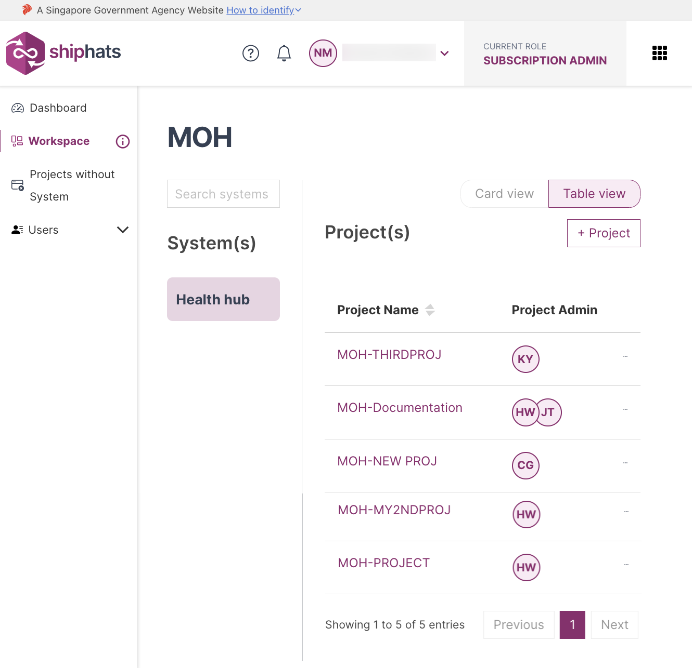

# Manage user groups & users

## Add/Remove user groups within a Project Tool

[Add user groups within a project tool](./snippets/add-remove-user-groups-in-project-tool.md ':include')

## Add/Remove users within a Project Tool

[Add users within a Project Tool](./snippets/add-remove-users-in-project-tool.md ':include')

<!--## Remove user groups from a Project Tool

[Remove user groups from a project tool]()-->

## Related topics

- [Manage users](manage-users)
- [Manage user groups](manage-user-groups)

<!--# Manage user groups & users

**Topics**

- [Manage user groups within a project tool](#manage-user-groups-within-a-project-tool)
- [Manage users within a project tool](#manage-users-within-a-project-tool)-->

<!--- [Remove user groups from a project tool](#remove-user-groups-from-a-project-tool)-->

<!--## Manage user groups within a project tool

As a Subscription Admin or a Project Admin, you can manage following within a project tool or app:  
- User groups
- Permissions or Roles  

You can manage user groups and permissions/roles for the following tools:
- Confluence
- Fortify on Demand
- Jira
- Nexus IQ
- SonarQube

### To manage user groups for your project tool or app

1. From the side menu, click **Workspace**.
    
    The `<Subscription name>` screen appears, displaying all the systems added to your subscription.

    

1. Locate the required project, and then click the project.

    > **Note:** Alternatively, click three dots for more options, and then click **Manage Project**.

1. Click the tool for which you want to manage/add user groups, and then click the **Manage User Groups** tab.

1. In the **User Group** drop-down, select the required group. 
1. In **Select Role/Permission**, select the required role or permission, and then click **Update**. 

    The roles or permissions are updated in the portal as well as respective tools. Any permissions assigned via portal will override the previously assigned permissions in the tool.

    >**Note:** Any permissions assigned via portal will override the previously assigned permissions in NexusIQ at the app level.

## Manage users within a Project Tool

As a Subscription Admin or a Project Admin, you can manage users within a project tool or app. 

You can manage users for the following tools:
- Confluence
- JIRA
- Fortify on Demand
- Nexus IQ
- SonarQube

### To manage users for your project tool or app

1. From the side menu, click **Workspace**.
    
    The `<Subscription name>` screen appears, displaying all the systems added to your subscription.

    

1. Locate the required project, and then click the project.

    > **Note:** Alternatively, click three dots for more options, and then click **Manage Project**.

1. Click the tool for which you want to manage/add user groups, and then click the **Manage Users** tab.

1. If you want to manage users for **Jira**, **Confluence**, or **SonarQube**, just follow the on-screen instructions. 
1. If you want to manage users for **NexusIQ**, within the **Manage Users** tab: 
    - In the **User** drop-down, select the required user. 
    
    >**Note:** Users will appear here only if they were added in the [TechBiz portal](https://portal.techbiz.suite.gov.sg/).

    - In **Select Role/Permission**, select the required role or permission, and then click **Update**. 

    The roles or permissions are updated in the portal as well as respective tools.

1. If you want to manage users for **Fortify on Demand**, within the **Manage Users** tab:   
    - To **Manage user access**, select values in the **User(s)** field.  
    
       >**Note:** Users will appear here only if they were added in the [TechBiz portal](https://portal.techbiz.suite.gov.sg/).

    - To **Manage user role**, select values in the **User** and **Role** fields. 
    
    The roles or permissions are updated in the portal as well as respective tools.

### Related topics

- [Manage users](manage-users)
- [Manage user groups](manage-user-groups)
-->
<!--
## Remove user groups from a project tool

As a Subscription Admin or a Project Admin, you can remove permissions and roles within a project tool or app for the following tools:
- Confluence
- Jira
- Fortify on Demand
- Nexus IQ
- SonarQube

### To remove user groups for your project tool or app

1. From the side menu, click **Projects** to view all the projects in this subscription account.  
    >**Tip:** If needed, [Switch account](manage-account).

1. Click the required project.
    > **Note:** Alternately, click three dots for more options, and then click **Manage Project**.
    
1. Click the tool for which you want to remove user groups.
1. Click **Manage**, and then click **Manage/add users**.

    The **Manage Tool** window appears. 
    
    >**Note:** If you want to manage user groups for FOD, select **Manage Users** tab.   
    > - If you want to **Manage user access**, select values in the **User(s)** field.  
    > - If you want to **Manage user role**, select values in the **User** and **Role** fields. You can click **Role glossary** to learn more about roles. 
    
1. In the **App Name** and **User Group** fields, select the App and user group for which you want to update permissions or roles.  This step is not applicable for FOD.
1. Next to the permissions or roles that you want to remove, clear the check box. This step is not applicable for FOD.
1. Click **Update**.  

    The permissions or roles are updated.
-->

<!--
1. From the **Select function** dropdown list, select **Manage/add user group**. 

1. In the Select the req

    |Available Tools|Steps|
    |---|---|
    | **Confluence** |Provide value in the **User Group** field, and then select the required permissions. 
    | **Jira** |Provide value in the **User Group** field, and then select the required roles. 
    |**Fortify on Demand** |Select **Manage user access** or **Manage user role** as required.   - If you want to **Manage user access**, select values in the **User(s)** field.   - If you want to **Manage user role**, select values in the **User** and **Role** fields.|   
    | **Nexus IQ**| Provide value in the **User Group** field, and then select the required roles. 
    | **SonarQube**| Provide values in the **App Name** and **User Group** fields, and then select the required permissions.  The **Browse** permission is selected by default along with any other permission. 
    
1. Click **Update**.

-->