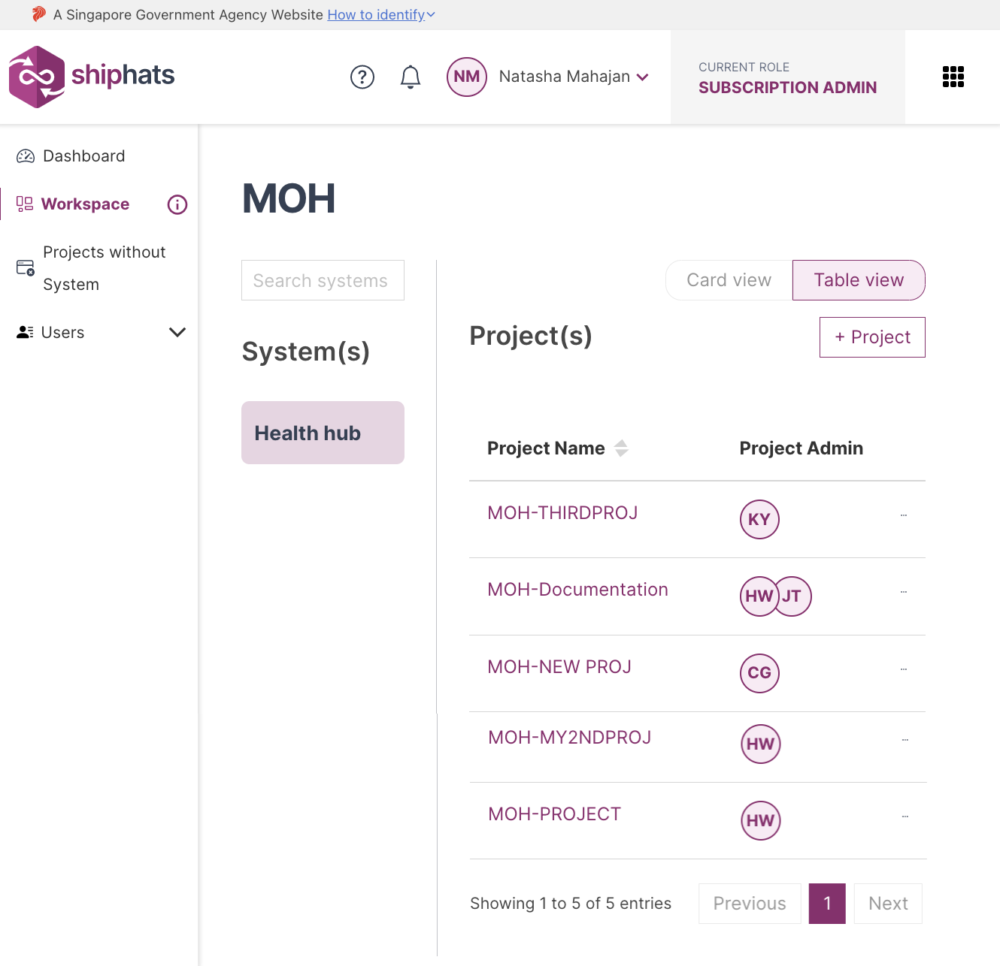

As a Subscription Admin or a Project Admin, you can manage users within a project tool or app. 

You can manage users for the following tools:
- Confluence
- JIRA
- Fortify on Demand
- Nexus IQ
- SonarQube

### To add/remove users for your project tool or app

1. From the side menu, click **Workspace**.
    
    The `<Subscription name>` screen appears, displaying all the systems added to your subscription.

    

1. Locate the required project, and then click the project.

    > **Note:** Alternatively, click three dots for more options, and then click **Manage Project**.

1. Click the tool for which you want to manage/add user groups, and then click the **Manage Users** tab.

1. If you want to manage users for **Jira**, **Confluence**, or **SonarQube**, just follow the on-screen instructions. 
1. If you want to manage users for **NexusIQ**, within the **Manage Users** tab: 
    - In the **User** drop-down, select the required user. 
    
    >**Note:** Users will appear here only if they were added in the [TechBiz portal](https://portal.techbiz.suite.gov.sg/).

    - In **Select Role/Permission**, select the required role or permission, and then click **Update**. 

    The roles or permissions are updated in the portal as well as respective tools.

1. If you want to manage users for **Fortify on Demand**, within the **Manage Users** tab:   
    - To **Manage user access**, select values in the **User(s)** field.  
    
       >**Note:** Users will appear here only if they were added in the [TechBiz portal](https://portal.techbiz.suite.gov.sg/).

    - To **Manage user role**, select values in the **User** and **Role** fields. 
    
    The roles or permissions are updated in the portal as well as respective tools.

