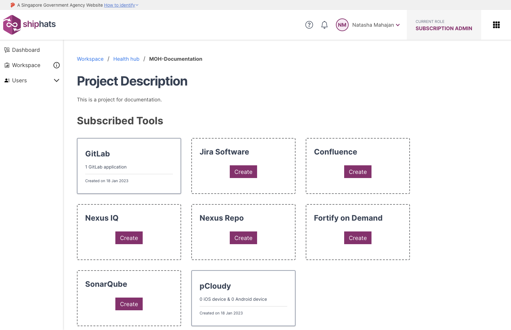

Subscription Admin (SA) and Project Admin (PA) can customise the project keys when adding app tools on SHIP-HATS. This feature is currently available for following tools:

- Jira 
- Confluence

**To add a project with customised project key** 

1. From the side menu, click **Workspace**.
    
    The `<Subscription name>` screen appears, displaying all the systems added to your subscription.

    

1. Locate the project to which you want to add a tool with customised key, and then click the project.

    **Project Description** screen appears, displaying the **Subscribed Tools** that the SA added in the TechBiz portal. You can also view **Not Subscribed Tools** that SA can subscribe via the TechBiz portal. 

    > Make sure that you have subscribed to Jira/Confluence product via the TechBiz portal for it to be listed in **Subscribed Tools**.

    

1. Locate the tool that you want to add with a customized key, click **Create**.

1. In the **Project Name** field, provide a value. 

1. In the **Project Key** field, enter the required project key. A project key can include:
    - 2-10 characters
    - Can contain uppercase letters A-Z 
    - Can contain numbers from 0-9
    - First character must be an alphabet 
1. Click **Add**.  
    
    The project tool with customised project key is added. 
