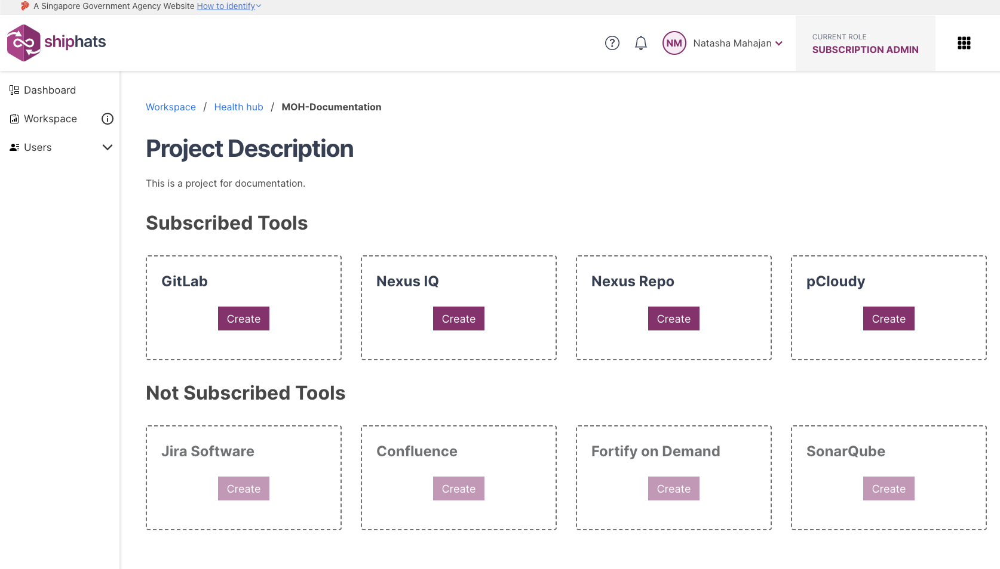
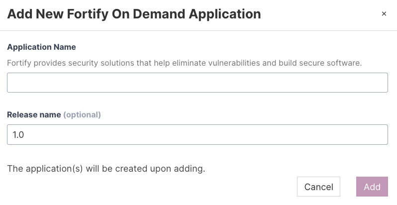
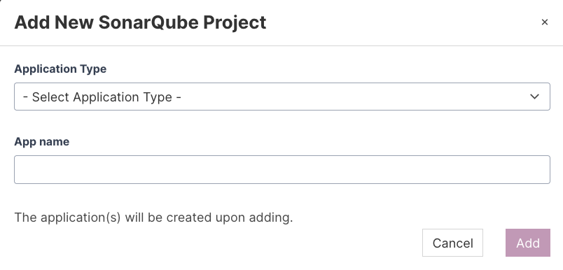

Subscription Admin (SA) and Project Admin (PA) can add the required project tools as explained below. You can add tools under the **Subscribed Tools** section based on the tools quota allotted for your subscription type. 

**To add project tools**

1. From the side menu, click **Workspace**.
    
    The `<Subscription name>` screen appears, displaying all the systems added to your subscription.

    

1. Locate the project to which you want to add a tool, and then click the project.

    **Project Description** screen appears, displaying the **Subscribed Tools** that the SA added in the TechBiz portal. You can also view **Not Subscribed Tools** that SA can subscribe via the TechBiz portal.

    > **Note:** Alternately, click three dots for more options, and then click **Manage Project**.

    

1. Locate the tool that you want to add, click **Create**, and follow the specific steps in table for the tool that you want to add.

    |Available Tools (Base)|Steps|
    |---|---|
    |**GitLab**|Make sure that at least 1 Project Admin has a GitLab account and is added to the TechPass group. Provide value in the **GitLab Group Name** field. <!-- If you cannot find your system in the drop-down list, follow the steps to [Declare a DGP System](declare-dgp-systems).-->   
    |**Nexus IQ**|Provide values in the **Application Name** and **Application ID** fields.|
    |**Nexus Repo**|[Raise a request](https://docs.developer.tech.gov.sg/docs/ship-hats-support/raise-service-request/) to add this tool.
    |**pCloudy**|The **Add New pCloudy Application** popup appears, displaying the allowed number of parallel shared mobile device tests.|

    |Available Tools (Add-ons)|Steps|
    |---|---|
    |**Confluence**|Make sure that you have subscribed to this product via the TechBiz portal for it to be listed in **Subscribed Tools**. Provide value in the **Project Name** field.   
    |**Fortify on Demand**| Make sure that you have subscribed to this product via the TechBiz portal for it to be listed in **Subscribed Tools**. Provide value in the **Application Name** and **Release name** fields. **Release name** is an optional field.      
    |**Jira**|Make sure that you have subscribed to this product via the TechBiz portal for it to be listed in **Subscribed Tools**. Provide value in the **Project Name** field.  
    |**Prisma Cloud**|Make sure that you have subscribed to this product via the TechBiz portal for it to be listed in **Subscribed Tools**. Provide value in the **App name** field.|
    |**SonarQube**|Make sure that you have subscribed to this product via the TechBiz portal for it to be listed in **Subscribed Tools**. Make sure that you have logged in to [SonarQube Community Edition](https://sonar.hats.stack.gov.sg/sonar) or [SonarQube Developer Edition](https://sonar1.hats.stack.gov.sg/sonar) at least once. provide values in the **Application Type** and **App Name** fields.  

    >**Note:** After you reach the quota, the respective tool name(s) will be disabled. If you still want to add these tools, send an email to [enquiries_ENP@tech.gov.sg](enquiries_ENP@tech.gov.sg).    

1. Click **Add**.   
    
    The selected project tool and application is added.
