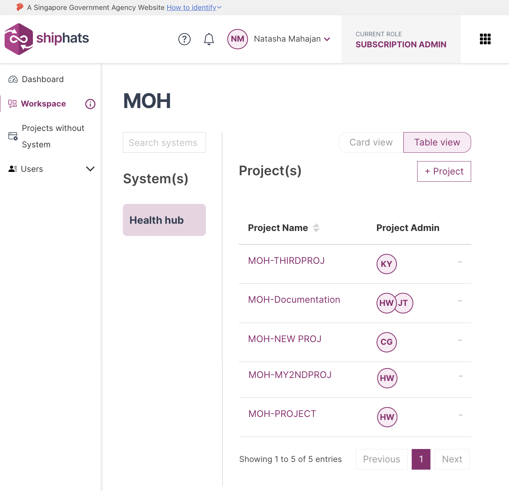

You can remove app from the following project tools:

- Fortify on Demand
- Jira
- Nexus IQ
- Prisma Cloud
- SonarQube (Community/Developer Edition)

**To remove an app**

1. From the side menu, click **Workspace**.
    
    The `<Subscription name>` screen appears, displaying all the systems added to your subscription.

    

1. Locate the required project, and then click the project.

    > **Note:** Alternatively, click three dots for more options, and then click **Manage Project**.

1. For **Jira**, **Confluence**, **Nexus IQ**, and **SonarQube**, click **Remove**. 

    The **Remove Application** window appears, indicating that this action is irreversible.

1. For **Fortify on Demand**, click three dots, and then select **Delete Application**.

    The **Remove Application** window appears, indicating that this action is irreversible.

1. Enter the requested information, and then click **Proceed**.  
    The selected app is removed.  
    If this the last app for the tool, the project tool is also removed. 
