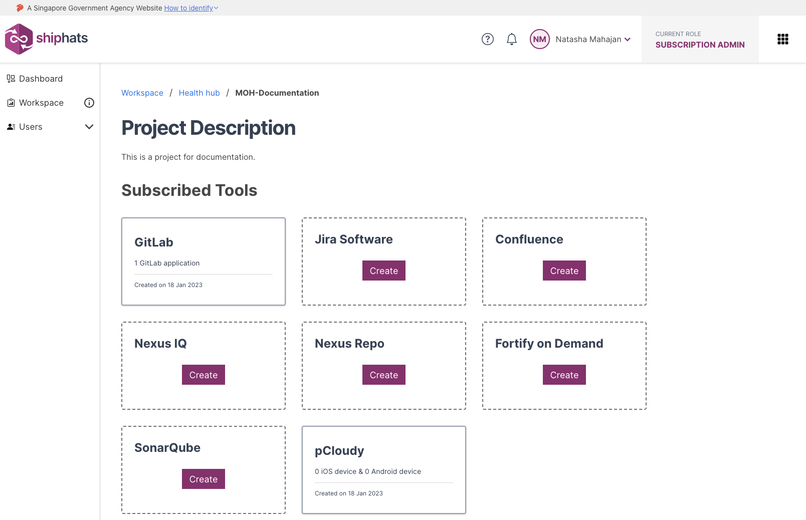

As a Subscription Admin or a Project Admin, you can **remove a tool or an app** when it is not required. You **[must take backup](#to-take-backup-of-a-project-tool)** before removing a project tool. 

You can remove the following tools: 

- GitLab
- Confluence
- Fortify on Demand
- Jira
- Nexus IQ
- SonarQube

### Backup 

**To take backup of a project tool**

As a Project Admin (PA), you can use the information in the following table based on your requirement:

|Tool|What to do|
|---|---|
**Confluence**|Export space as XML|
**Jira**|Export project with issues as XML|
**GitLab**|Clone Repos and Pipelines|
**Nexus IQ**|Download the required reports
**Nexus Repo**|Download the required artifacts

### Remove

**To remove a project tool**

1. Make sure that you **[take backup or download the required artifacts](#to-take-backup-of-a-project-tool)**.
1. From the side menu, click **Workspace**.
    
    The `<Subscription name>` screen appears, displaying all the systems added to your subscription.

    

1. Locate the project to which you want to remove a tool, and then click the project.

    **Project Description** screen appears, displaying the **Subscribed Tools** that the SA added in the TechBiz portal. You can also view **Not Subscribed Tools** that SA can subscribe via the TechBiz portal. 

    

1. Click the tool that want to remove, and then click **Remove** in the upper right corner.

    The **Remove Application** window appears. 
    
1. Enter the requested information, and then click **Proceed**.  

    The selected app is removed. If this the last or only app for the tool, the project tool is also removed. 

